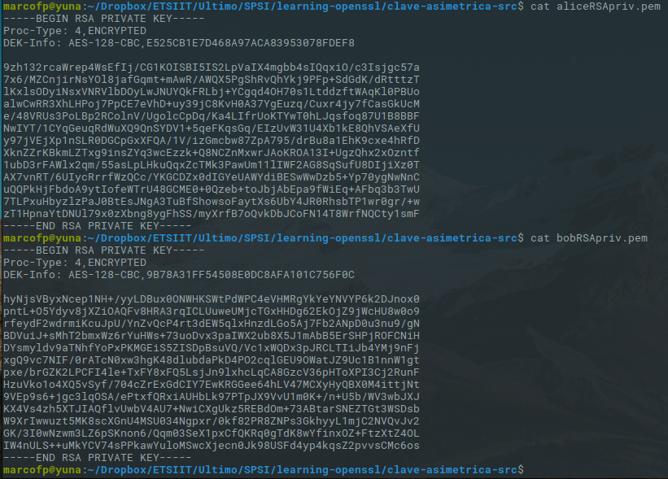

# Ejercicios de claves asimétricas

* Contraseña utilizada: `0123456789`
* Para generar par de claves: `openssl genrsa`
* Para extraer claves, manipularlas y/o cifrarlas: `openssl rsa`
* Para descifrar, cifrar, firmar y verificar con las claves dadas: `openssl rsault`
* Para generar y manipular parámetros asociados a curvas elípticas y parejas de claves: `openssl ecparam`
* Para extraer y/o manipular claves a partir de curvas elípticas: `openssl ec`
* Para generar claves aleatorias de sesión: `openssl rand`

* Usas flags `--text` y `--noout` para visualizar salida de claves.

## Tareas a realizar

#### 1. Generar dos pares de claves RSA de 1024 bits. No protegida por contraseña.

#### 2. Extraer la clave privada contenida en en cada uno de los pares, a otro archivo protegido por contraseña cifrándolo con AES-128. Mostrar sus valores.

#### 3. Extraer la clave publica de cada uno de los pares. No debe estar cifrada ni protegida. Mostrar sus valores.

#### 4. Reutilizar el archivo input.bin de 1024 bits, todos a 0, cifrandolo con las claves publicas y explicar el resultado.

#### 5. Diseñar un cifrado híbrido, con RSA como sistema asimétrico para enviar información entre dos puntos. Las claves de sesión para el algoritmo simétrico deben ser aleatorias, generadas con `openssl rand` y luego utilizar ese archivo para generar clave y vector de inicialización mediante la opción `-kfile`.

#### 6. Utilizando el criptosistema híbrido diseñado, cifrar en ambos puntos el archivo input.bin con la clave pública del punto contrario. Descifrar en cada punto con la clave privada y comparar el resultado con el archivo original.

#### 7. Generar un archivo que contenga los parámetros públicos de una de las curvas elípticas contenidas en las transparencias de teoría. Si no se logran localizar hacer el resto de ejercicios con una curva cualquiera de las disponibles en OpenSSL. Mostrar los valores.

#### 8. Generar dos pares de claves para los parámetros anteriores. No protegidas por contraseña.

#### 9. Extraer la clave privada contenida en el archivo  de cada clave, protegido por contraseña cifrandolo con 3DES. Mostrar sus valores.

#### 10. Extraer la clave pública contenida en el archivo de cada clave, sin protegerlo con contraseña.
